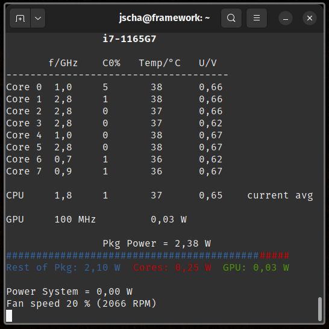

# cpumon
A CLI based cpu monitoring application inspired by Throttlestop.

Cpumon monitors quantities like frequency, load, temperature, voltage and power draw of your cpu.



It can be used to investigate CPU-related issues with the system regarding performance or battery life.

The application accesses various parts of sysfs and machine specifc registers (MSR) of the CPU.

# Run

```bash
sudo ./cpumon
```

# Provide Feedback

Tested with i7-1165G7 on Pop!_OS 22.04._ The application aims to be compatible with a variety of CPUs. If the application doesn't display certain quantities on your system, feel free to submit a screenshot and the cpu model. Maybe I can work out the problem.

